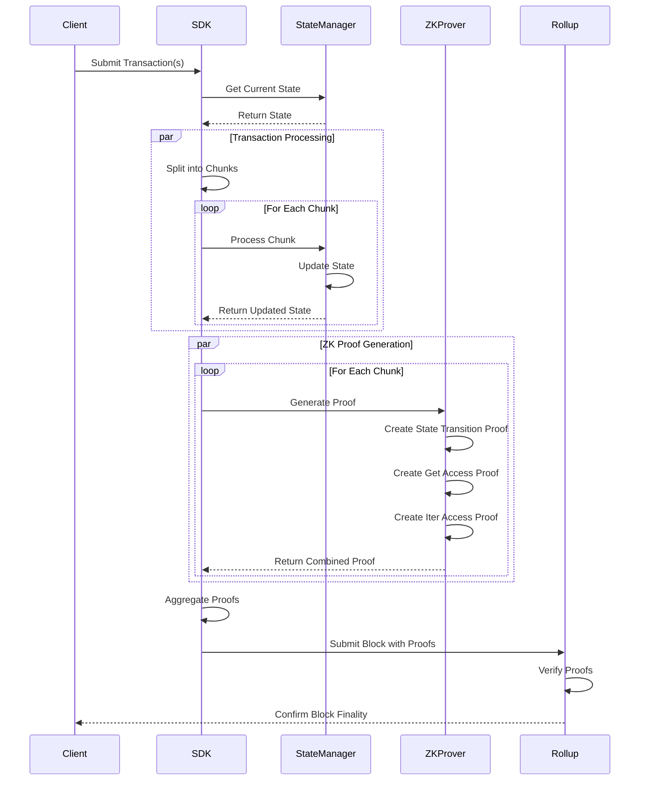

# InterLiquid SDK

InterLiquid SDK is a powerful software development kit for building ZK Sovereign Rollups, designed to provide Web2-like User Experience and Developer Experience for decentralized applications. It enables Web2 applications to seamlessly interact with public DeFi ecosystems.

## 🌟 Key Features

- **Key Prefix Based Iteration**: Enables efficient state iteration similar to NoSQL systems like Firebase Firestore
- **ZK-Friendly Architecture**: Built with Zero Knowledge Proofs in mind
- **Flexible Deployment**: Suitable for both ZK and Optimistic Sovereign Rollups
- **Parallelized Proof Generation**: Optimized for performance with parallel processing
- **Divide-and-Conquer Proof Aggregation**: Efficient proof generation and verification

## 🏗️ Architecture

### Twin Radix Trees

The SDK's core innovation is the Twin Radix Trees architecture, which combines:

1. **4-bit-Radix State Patricia Trie** - for state inclusion proof
2. **4-bit-Radix Keys Patricia Trie** - for key indexing to enable key prefix based iteration

### Proof Generation

The SDK implements an efficient proof generation system with:

- Parallel transaction processing
- Divide-and-conquer proof aggregation
- Pipelined aggregation process
- Optimized block proof structure

## 💻 Technical Architecture

### Core Components

1. **Twin Radix Trees**
2. **State Management**
   - Efficient key-value storage with prefix-based iteration
   - ZK-friendly state transitions
   - State transition function:
     ```
     StateNext = f(StatePrev, Txs)
     ```

3. **Transaction Processing**
   - Chunked transaction processing for parallel execution
   - Parallel ZK proof generation
   - Recursive proof aggregation

### Implementation Details

#### State Transition Proof
```rust
pub struct State8RadixSmtInclusionProof {
    pub path: [Option<State8RadixSmtPath>; 31],
    pub leaf_hash: [u8; 32],
}

pub struct State8RadixSmtPath {
    pub child_index: u8,
    pub sibling_hashes: [Option<[u8; 32]>; 255],
}
```

#### Key Indexing
```rust
pub struct Key8RadixPatriciaNode {
    pub key_fragment: Vec<u8>,
    pub children: [Option<Key8RadixPatriciaNode>; 256],
}
```

### Transaction Processing Flow



### 📁 Code Structure

```
src/
├── core/         # Core functionality and interfaces
│   ├── state.rs  # State management
│   └── tx.rs     # Transaction processing
├── state/        # State implementation
│   ├── smt.rs    # Sparse Merkle Tree
│   └── patricia.rs # Patricia Trie
├── tx/           # Transaction processing
│   ├── chunk.rs  # Chunk management
│   └── proof.rs  # Proof generation
├── types/        # Common types
├── utils/        # Utility functions
└── x/            # Extended functionality
    └── bank/     # Bank module implementation
```

### 🔐 ZK Proof Generation

1. **State Transition Proof**
   ```rust
   PublicInputsStf = [StateRootPrev, StateRootNext, TxRoot]
   PrivateInputsStf = [
       StatePrev^{get, iter},
       StateNext^{set, del},
       StateNodeHashes^{NoAccess},
       Txs
   ]
   ```

2. **Get Access Proof**
   ```rust
   PublicInputsGet = [StateSmtRootPrev, KeysHash]
   PrivateInputsGet = [{Key_j, StateSmtInclusionProof_j}_{j=1}^k]
   ```

3. **Iter Access Proof**
   ```rust
   PublicInputsIter = [KeyPatriciaRootPrev, KeyPrefixesHash]
   PrivateInputsIter = [{KeyPrefix_j, KeyPatriciaNodes_j}_{j=1}^k]
   ```

### ⚡ Parallel Processing

The SDK implements parallel processing through chunking:

```rust
// Chunk processing
{StateRootNext_i, StateNext_i^{set, del}, {Key_ij, KeyPrefix_ij}_{j=1}^k} 
= g({StateRootPrev, StatePrev_i^{get, iter}}, StateNodeHashes_i^{NoAccess}, TxsChunk_i)

// Proof aggregation
PublicInputsAgg = [StateRootPrev_1, StateRootNext_n, TxRoot]
PrivateInputsAgg = [{StateRootPrev_i}_{i=2}^n, {StateRootNext_i}_{i=1}^{n-1}, {ProofChunk_i}_{i=1}^n]
```

## 🎯 Use Cases

- Building ZK Sovereign Rollups
- Creating Web2-compatible dApps
- Implementing efficient state management
- Developing scalable DeFi applications

## Example

Below is a snippet from our basic usage example (`examples/basic_usage.rs`). This example demonstrates how to submit a transaction via the `/tx` API endpoint using our SDK:

```rust
// Create a MsgSend transaction
let mut tokens = Tokens::new();
tokens.insert("usdc".to_string(), U256::new(U256Lib::from(100u64)));
let msg = MsgSend {
    from_address: alice,
    to_address: bob,
    tokens,
};
let mut msg_bytes = Vec::new();
msg.serialize(&mut msg_bytes).unwrap();
let msg_any = SerializableAny::new(MsgSend::TYPE_NAME.to_owned(), msg_bytes);

// Wrap the message in a SimpleTx
let tx = SimpleTx {
    msgs: vec![msg_any],
};
let mut tx_bytes = Vec::new();
tx.serialize(&mut tx_bytes).unwrap();

// Send transaction via TCP
let tx_base64 = BASE64_STANDARD.encode(&tx_bytes);
let request = format!(
    "POST /tx HTTP/1.1\r\n\
     Host: localhost:3000\r\n\
     Content-Type: application/json\r\n\
     Content-Length: {}\r\n\
     \r\n\
     {{\"tx_base64\":\"{}\"}}",
    tx_base64.len() + 15,
    tx_base64
);

if let Ok(mut stream) = TcpStream::connect("localhost:3000") {
    if stream.write_all(request.as_bytes()).is_ok() {
        println!("Transaction sent successfully!");
    } else {
        eprintln!("Failed to send transaction");
    }
} else {
    eprintln!("Failed to connect to server");
}
```

### Key Points About the Example:
- **API-First Design:** The example demonstrates how to submit a transaction via the `/tx` API endpoint, following a Cosmos SDK-style approach where developers interact with the chain via API endpoints rather than direct state access.
- **Transaction Submission:** The example constructs a `MsgSend` transaction, serializes it, and sends it to the server using a TCP connection.
- **Server Handling:** The server processes the transaction and updates the state accordingly.

## 📚 Documentation

For detailed technical documentation, please refer to our [whitepaper](https://interliquid.sunriselayer.io/whitepaper/).


