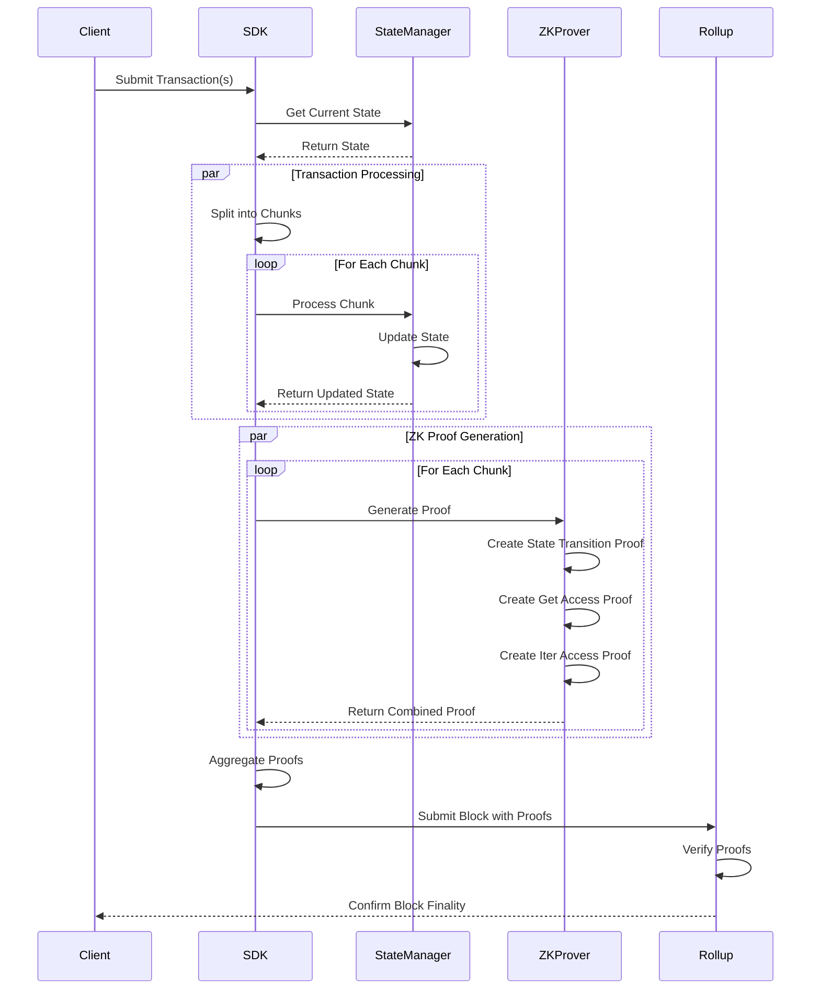

# InterLiquid SDK


InterLiquid SDK is a software development kit for building ZK Sovereign Rollups, designed to bridge Web2 and Web3 development experiences. It enables seamless integration of Web2 applications with public DeFi ecosystems while maintaining blockchain security.

## 🌟 Features

- **ZK Sovereign Rollup Support**: Build applications with zero-knowledge proof verification
- **Web2-like Developer Experience**: Familiar development patterns and tools
- **Key Prefix Based Iteration**: Efficient state management and querying
- **Parallelized ZK Proof Generation**: Optimized performance through chunked processing
- **Twin Nibble Trees Architecture**: Innovative state management system
- **Cross-Platform Compatibility**: Works with Sunrise and other platforms

## 📚 Documentation

For detailed technical documentation, please refer to our [Whitepaper](whitepaper/whitepaper.md).

## Technical Architecture

### Core Components

1. **Twin Nibble Trees**
   - 4-bit-Radix Sparse Merkle Tree for state inclusion proof
   - 4-bit-Radix Patricia Trie for key indexing
   - State root calculation: `StateRoot = h(StateSmtRoot || KeyPatriciaRoot)`

2. **State Management**
   - Efficient key-value storage with prefix-based iteration
   - ZK-friendly state transitions
   - State transition function:
     ```
     StateNext = f(StatePrev, Txs)
     ```

3. **Transaction Processing**
   - Chunked transaction processing for parallel execution
   - Parallel ZK proof generation
   - Recursive proof aggregation

### Implementation Details

#### State Transition Proof
```rust
pub struct State4RadixSmtInclusionProof {
    pub path: [Option<State4RadixSmtPath>; 63]
    pub leaf_hash: [u8; 32],
}

pub struct State4RadixSmtPath {
    pub child_index: u8,
    pub sibling_hashes: [Option<[u8; 32]>; 15],
}
```

#### Key Indexing
```rust
pub struct Key4RadixPatriciaNode {
    pub key_fragment: Vec<u8>,
    pub nibble_front: bool,
    pub nibble_back: bool,
    pub children: [Option<Key4RadixPatriciaNode>; 16],
}
```

### Transaction Processing Flow



### Code Structure

```
src/
├── core/         # Core functionality and interfaces
│   ├── state.rs  # State management
│   └── tx.rs     # Transaction processing
├── state/        # State implementation
│   ├── smt.rs    # Sparse Merkle Tree
│   └── patricia.rs # Patricia Trie
├── tx/           # Transaction processing
│   ├── chunk.rs  # Chunk management
│   └── proof.rs  # Proof generation
├── types/        # Common types
├── utils/        # Utility functions
└── x/            # Extended functionality
```

### ZK Proof Generation

1. **State Transition Proof**
   ```rust
   PublicInputsStf = [StateRootPrev, StateRootNext, TxRoot]
   PrivateInputsStf = [
       StatePrev^{get, iter},
       StateNext^{set, del},
       StateNodeHashes^{NoAccess},
       Txs
   ]
   ```

2. **Get Access Proof**
   ```rust
   PublicInputsGet = [StateSmtRootPrev, KeysHash]
   PrivateInputsGet = [{Key_j, StateSmtInclusionProof_j}_{j=1}^k]
   ```

3. **Iter Access Proof**
   ```rust
   PublicInputsIter = [KeyPatriciaRootPrev, KeyPrefixesHash]
   PrivateInputsIter = [{KeyPrefix_j, KeyPatriciaNodes_j}_{j=1}^k]
   ```

### Parallel Processing

The SDK implements parallel processing through chunking:

```rust
// Chunk processing
{StateRootNext_i, StateNext_i^{set, del}, {Key_ij, KeyPrefix_ij}_{j=1}^k} 
= g({StateRootPrev, StatePrev_i^{get, iter}}, StateNodeHashes_i^{NoAccess}, TxsChunk_i)

// Proof aggregation
PublicInputsAgg = [StateRootPrev_1, StateRootNext_n, TxRoot]
PrivateInputsAgg = [{StateRootPrev_i}_{i=2}^n, {StateRootNext_i}_{i=1}^{n-1}, {ProofChunk_i}_{i=1}^n]
```

### Security Measures

1. **Zero-Knowledge Proofs**
   - State transition verification
   - Get access validation
   - Iter access validation

2. **State Management**
   - Merkle tree-based state validation
   - Patricia trie for key indexing
   - 4-bit radix optimization

3. **Parallel Processing**
   - Chunked transaction processing
   - Parallel proof generation
   - Recursive proof aggregation

### Usage Example

```rust
use interliquid_sdk::core::InterLiquid;
use interliquid_sdk::state::StateManager;
use interliquid_sdk::tx::TransactionProcessor;

// Initialize components
let sdk = InterLiquid::new();
let state_manager = StateManager::new();
let tx_processor = TransactionProcessor::new();

// Process transactions
let txs = vec![/* your transactions */];
let result = sdk.process_transactions(txs, &state_manager, &tx_processor);

// Handle result
match result {
    Ok(block) => {
        println!("Block processed successfully: {:?}", block);
    }
    Err(e) => {
        println!("Error processing block: {:?}", e);
    }
}
```

For more technical details, refer to the [Whitepaper](whitepaper/whitepaper.md).

## 🧑‍💻 Example: Basic Usage

A minimal working example is provided in [`examples/basic_usage.rs`](examples/basic_usage.rs).
This example demonstrates how to set up a dummy context, state manager, and transaction, and how to execute a transaction using the SDK's core `App` interface.

**Purpose:**
- Show the minimal boilerplate needed to use the SDK's core traits and types.
- Illustrate how to implement the required traits (`Context`, `StateManager`, `Tx`) for custom logic or testing.
- Provide a template for integrating your own state management and transaction types.

**How to run:**
```sh
cargo run --example basic_usage
```

**Example code:**
```rust
use interliquid_sdk::core::{App, Context, MsgRegistry};
use interliquid_sdk::state::StateManager;
use interliquid_sdk::tx::Tx;
use interliquid_sdk::types::InterLiquidSdkError;
use borsh_derive::BorshDeserialize;

// Dummy context, state manager, and transaction implementations...
// (see examples/basic_usage.rs for full code)

fn main() {
    let mut app = App::<DummyContext, DummyTx>::new();
    let mut ctx = DummyContext::new();
    let tx = DummyTx;
    let result = app.execute_tx(&mut ctx, &tx);
    println!("Result: {:?}", result);
}
```
