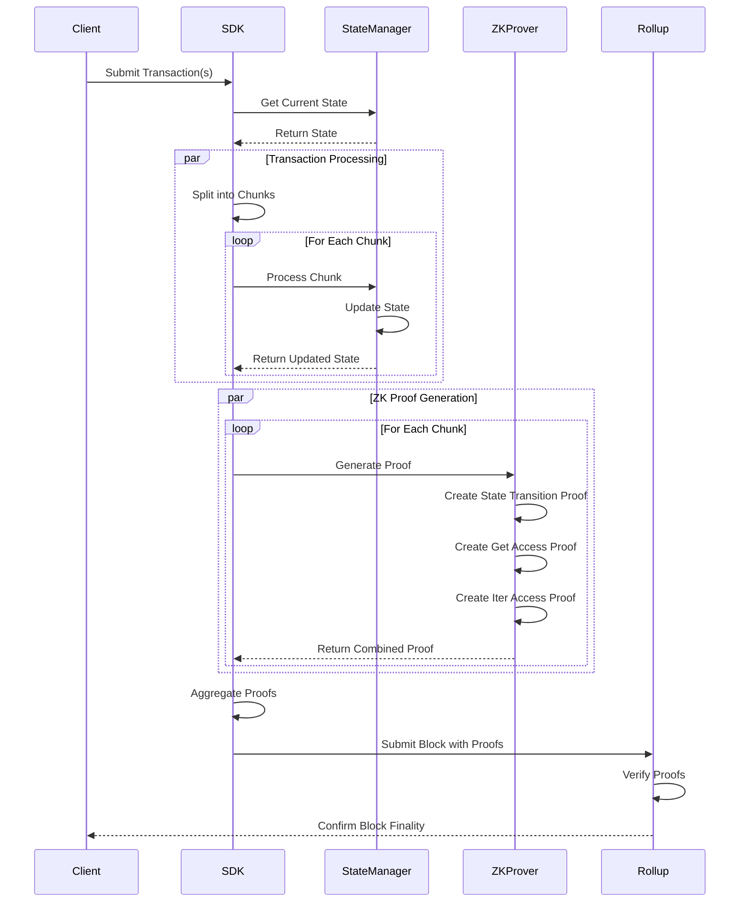

# Transaction Processing Flow

## Explanation

1. **Transaction Submission**
   - Client submits transactions to the SDK
   - SDK retrieves current state from StateManager

2. **Transaction Processing**
   - Transactions are split into chunks for parallel processing
   - Each chunk is processed independently
   - State updates are tracked per chunk

3. **ZK Proof Generation**
   - For each chunk, three types of proofs are generated:
     - State Transition Proof
     - Get Access Proof
     - Iter Access Proof
   - Proofs are generated in parallel for each chunk

4. **Proof Aggregation**
   - All chunk proofs are aggregated into a single proof
   - The aggregated proof is submitted to the rollup

5. **Block Finality**
   - Rollup verifies the proofs
   - Once verified, block is finalized
   - Client receives confirmation

This parallel processing approach significantly improves performance while maintaining security through zero-knowledge proofs.
