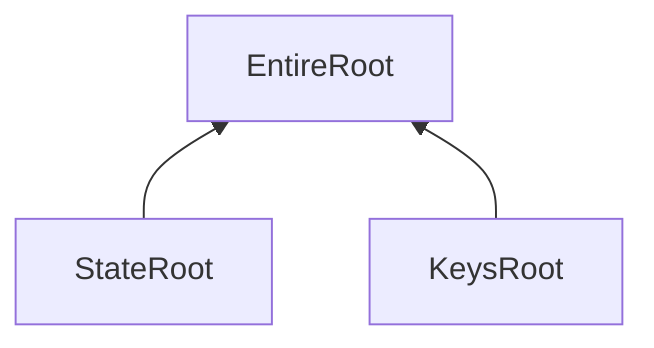
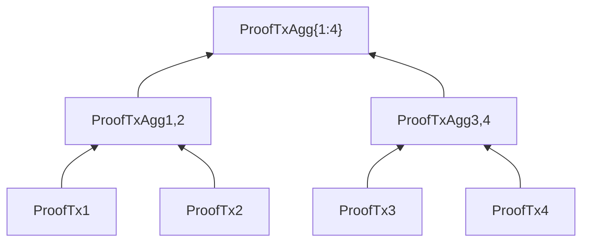
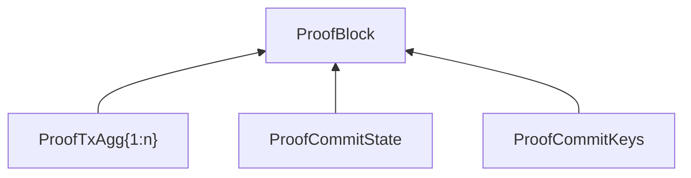

# InterLiquid SDK

Author: KIMURA Yu ([Sunrise](https://sunriselayer.io))

## Introduction

InterLiquid SDK is a software development kit for building ZK Sovereign Rollups.
It aims to realize Web2-like User Experience and Web2-like Developer Experience for dApps.
In other words, it aims to serve a capability for non-Web3 applications to interact with public DeFi ecosystem.
The term "apps" encompasses not only web applications but also application logic of financial systems.

It is suitable for building on Sunrise, but it is not limited to it.

Also if you think that the evolution of hardware acceleration of ZK proof generation is not enough, it is possible to use it for Optimistic Sovereign Rollups.

To clarify the word of Sovereign Rollup, in ZK Sovereign Rollup, validity proof of state transition are submitted to rollup itself, and in Optimistic Sovereign Rollup, fraud proof is submitted to rollup itself.

## Why Iteration Matters

Key prefix based iteration is a common pattern in Web2 development.
Only if it exists can on-chain logic be as flexible as that of NoSQL systems like Firebase Firestore.

For example, imagine iterating all vote info in a governance contract.
The key should be like `gov/votes/{proposal_id}/{voter_address}`.
Here, it is very useful to iterate all vote info in a certain proposal by designating a key prefix like `gov/votes/{proposal_id}`.

However, it is not possible in almost all public blockchains.
Even fundamental features like governance vote iteration are not supported.
It is one of the most painful problems for Developer Experience.

Of course Indexing services should be utilized for proper purposes like search and analytics.
However, enforcing developers to pay for subscription of Indexing services only for succinct iteration on frontend side,
while serving the query function which is available only if the user could calculate the slot id of the state like EVM,
is very absurd.

For succinct purposes, key prefix based iteration should be supported by the blockchain itself, moreover on-chain.

### Ethereum

Ethereum's state is managed in a Patricia Merkle Trie (PMT) for each address including smart contract address and EOA address, and further internal state of each smart contract is stored in a Patricia Merkle Trie inside the address state.
Because PMT hashes each key, it disallow developers from iterating state in a key prefix based way.

### Solana

Solana's state is stored respectively with each account.
Thanks to its design, Solana succeeded to parallelize state transition for each account.
However, it is not possible to iterate state in a key prefix based way.
By making each account like B-tree node, developers can realize the structure of B-tree artificially, but it requires paying Solana account rent and the Developer Experience is terrible.

Not only Solana, but also other chains like scalable monolithic blockchains (e.g. Sui) have the same structure to make it scalable.
Given that next-generation financial infrastructure demands key prefix based iterable state, the cluster of interoperable rollups provide better solutions than monolithic chains.

### Cosmos SDK

Cosmos SDK's state is managed with IAVL tree.
It allows developers to iterate state in a key prefix based way because the key is not hashed.
However, IAVL has a mechanism of self-rebalancing tree, and it is not proper to prove with Zero Knowledge Proofs.
If we try to remove the mechanism of self-rebalancing (it means it is simple binary tree), it causes an attack vector to make the inclusion proof of a certain key too large because the depth of the node in the tree can be operated by an attacker.

### Polkadot SDK (Substrate)

Polkadot SDK's state is managed with Patricia Merkle Trie.
It also supports key prefix based iteration with the unique way.
In the Polkadot SDK, the key is separated into the prefix parts, and each prefix part is hashed.

For example, if the application logic want to access the state with the key  `gov/votes/{proposal_id}/{voter_address}`, it is hashed with each prefix part like `gov/votes/{hash(proposal_id)}/{proposal_id}/{hash(voter_address)}/{voter_address}`.

This design allows the application logic to iterate the state in a key prefix based way.
However, there are two limitations.

Firstly, the key is hashed, so it is not able to iterate with the sorted order.
If we iterate all the state and sort them, the meaning of the iteration is lost because it can be achieved by storing the entire array in one key.

Secondly, the key is hashed, so the proof of the inclusion of the iterated key is not ZK friendly.
It is not possible to prove the completeness of the iterated key as we do in InterLiquid SDK.

## Techincal: The challenge of InterLiquid SDK

The challenge of InterLiquid SDK is to make key prefix based iteration and ZK friendliness coexisting.
The architecture to achieve this is **Twin Radix Trees**.

Before explaining Twin Radix Trees, let's see how to prove the validity of state transition with ZKP.

### ZKP of State transition

Generally speaking, state transition function is described as follows:

$$
\text{StateNext} = f(\text{Txs}, \text{StatePrev})
$$

We need to prove the validity of the above equation with ZKP.
We assume to use zkVM.
To prove this, the state transition function is adjusted as follows:

$$
\begin{aligned}
  &\{\text{StateRootNext}, \text{Diffs}\} \\
  &= \hat{f}(\text{Txs}, \text{StateRootPrev} , \text{StateForAccess}, \text{StateCommitPath})
\end{aligned}
$$

Because zkVMs cannot access the storage directly, we need to give the state to access $$ \text{StateForAccess} $$ beforehand.
It is also enough to output only the diffs $$ \text{Diffs} $$ without entire state.
To calculate the $$ \text{StateRootNext} $$, it is also needed to give the state commit path $$ \text{StateCommitPath} $$ to allow zkVM to calculate the state root.

By committing these three values $$\text{StateRootPrev}$$, $$\text{StateRootNext}$$ and $$\text{TxsRoot}$$ as the public input of the ZKP, it is possible to generate the verifiable validity proof of the state transition.

$$
\begin{aligned}
  \text{WitnessStf} &= \left\{ \begin{aligned}
    & \text{Txs} \\
    & \text{StateForAccess} \\
    & \text{Diffs} \\
    & \text{StateCommitPath}
  \end{aligned} \right\} \\
  \text{PubInputsStf} &= \left\{ \begin{aligned}
    & \text{TxsRoot}(\text{Txs}) \\
    & \text{StateRootPrev} \\
    & (\text{StateForAccess}, \text{StateCommitPath}) \\
    & \text{StateRootNext} \\
    & (\text{StateForAccess}, \text{Diffs}, \text{StateCommitPath})
  \end{aligned} \right\} \\
  \text{ProofStf} &= \text{CircuitStf}(\text{WitnessStf}, \text{PubInputsStf})
\end{aligned}
$$

Hereafter the relation between $$\text{ProofXXX}$$, $$\text{WitnessXXX}$$ and $$\text{PubInputsXXX}$$ is omitted.

### Security assumptions

Here, it is said that we give the state to zkVM beforehand.
If we don't prove that the given state is correct, it is possible to make a false proof.
To prevent this, we also need to prove that the given state is correct.

Proving inclusion for get-access (i.e., a single designated key) is straightforward.
Merkle inclusion proof with the given state root is enough.

However, proving it for iter access (all keys which match the designated key prefix) requires a smart design.
*Twin Radix Trees* enables it while keeping the ZK friendliness.

### Twin Radix Trees

Twin Radix Trees combines two tree components:

- 4-bit-Radix State Patricia Trie for state inclusion proof
- 4-bit-Radix Keys Patricia Trie for key indexing to enable key prefix based iteration

The state root is calculated by the following equation where $$h$$ is the hash function:

$$
\text{EntireRoot} = h(\text{StateRoot} || \text{KeysRoot})
$$

### 4-bit-Radix State Patricia Trie

This tree works for the state inclusion proof.

It can be used for proving get access validity in the state transition, and also for state inclusion proof of light client based interoperability protocol like IBC.

The leaf index is determined by the key hash, and the leaf value is the state hash.

Thanks to the property of the hash function, the attack vector of increasing the inclusion proof size of the specific key is also reduced.

To prove the validity of get access, it is needed to prove the inclusion of the key in the tree for $$ \text{ReadKVPairs} $$.

$$
\begin{aligned}
  \text{WitnessRead} &= \left\{ \begin{aligned}
    & \text{StateForAccess} \\
    & \text{ReadKVPairs} \\
    & \text{ReadProofPath}
  \end{aligned} \right\} \\
  \text{PubInputsRead} &= \left\{ \begin{aligned}
    & \text{StateRootPrev} \\
    & (\text{StateForAccess}, \text{ReadKVPairs}, \text{ReadProofPath}) \\
    & \text{ReadKVPairsHash}(\text{ReadKVPairs})
  \end{aligned} \right\}
\end{aligned}
$$

It is also needed to prove the non-inclusion of the key which was tried to be be accessed in the STF but not found. To do this, it is enough to prove the inclusion of dead end node in the tree.

### 4-bit-Radix Keys Patricia Trie

This trie works for the key indexing.

It can be used for proving iter access validity in the state transition.

The node hash is calculated by the following equation where $$h$$ is the hash function:

$$
\begin{aligned}
  &\text{KeysNodeHash} \\
  &= \begin{cases}
    \begin{aligned}
      h(&\text{KeyFragment} \\
        &|| \text{ChildNodeHash}_1 || ... || \text{ChildNodeHash}_{256})
    \end{aligned} & \text{if } \text{ChildBitmap} \neq 0\\
    \text{EmptyByte} & \text{if } \text{ChildBitmap} = 0
  \end{cases}
\end{aligned}
$$

To prove the validity of iter access, it is needed to re-construct the node hash of the designated key prefix with all iterated keys, and prove its inclusion in the tree.

$$
\begin{aligned}
  \text{WitnessIter} &= \left\{ \begin{aligned}
    & \text{StateForAccess} \\
    & \text{IterKVPairs} \\
    & \text{IterProofPath}
  \end{aligned} \right\} \\
  \text{PubInputsIter} &= \left\{ \begin{aligned}
    & \text{KeysRootPrev} \\
    & (\text{StateForAccess}, \text{IterKVPairs}, \text{IterProofPath}) \\
    & \text{IterKVPairsHash}(\text{IterKVPairs})
  \end{aligned} \right\}
\end{aligned}
$$

It is straightforward to think that this proof is mathematically heavy, but there is a room for parallelization.

### Parallelization of ZKP generation

Generally speaking, the list of transactions is a part of the block.

$$
  \text{Txs} \in \text{Block}
$$

In the InterLiquid SDK, to get the accessed state which is needed to give to zkVM, it is needed to execute the transactions once outside of the zkVM.

Here, we can get the interim result of the state transition function for each transaction $$\{\text{Tx}_i\}_{i=1}^{n}$$, with emitting the accessed key value pairs $$\text{ReadKVPairs}_i$$ and $$\text{IterKVPairs}_i$$:

$$
\begin{aligned}
  &\left\{ \text{AccumDiffsNext}_i, \text{ReadKVPairs}_i, \text{IterKVPairs}_i \right\} \\
  &= g\left(\text{StateForAccess}_i, \text{AccumDiffsPrev}_i, \text{Tx}_i\right)
\end{aligned}
$$

Then we can generate the proof in parallel for each transaction with one circuit which can be regarded as a combination of $$\text{ProofStf}_i$$, $$\text{ProofGet}_i$$, and $$\text{ProofIter}_i$$:

$$
\begin{aligned}
  \text{AccumDiffsHashPrev}_1 &= \text{EmptyByte} \\
  \text{WitnessTx}_i &= \left\{ \begin{aligned}
    & \text{Tx}_i \\
    & \text{StateRoot} \\
    & \text{KeysRoot} \\
    & \text{StateForAccess}_i \\
    & \text{AccumDiffsPrev}_i \\
    & \text{ReadProofPath}_i \\
    & \text{IterProofPath}_i
  \end{aligned} \right\} \\
  \text{ConstraintsTx}_i &= \left\{ \begin{aligned}
    & \text{StateRoot} \\
    & (\text{StateForAccess}_i, g(\dots), \text{ReadProofPath}_i) \\
    & \text{KeysRoot} \\
    & (\text{StateForAccess}_i, g(\dots), \text{IterProofPath}_i)
  \end{aligned} \right\} \\
  \text{PubInputsTx}_i &= \left\{\begin{aligned}
    & \text{TxHash}_i(\text{Tx}_i) \\
    & \text{AccumDiffsHashPrev}_i(\text{AccumDiffsPrev}_i) \\
    & \text{AccumDiffsHashNext}_i(g(\dots)) \\
    & \text{EntireRoot} \\
    & (\text{StateRoot}, \text{KeysRoot})
  \end{aligned} \right\}
\end{aligned}
$$

Not only for the parallelization but also the fact that the proof of ZK-STARK requires quasi-linear time $$\mathcal{O}(n \log{n})$$ in proportion to the number of traces, it is meaningful to process transactions respectively. Some zkVMs already have the feature to divide the stack trace, but it is still effective to make the pipeline of proof generation described below.

By combining these three circuits, we can omit $$\text{KeysHash}$$ and $$\text{KeyPrefixesHash}$$ in the public inputs of the ZKP because fundamentally STF $$g$$ can generate $$\text{ReadKVPairs}_i$$ and $$\text{IterKVPairs}_i$$ by itself.

Needless to say, $$\text{StateRootPrev}$$ and $$\text{KeysRootPrev}$$ which need to be verified, also can be verified by using $$\text{PubInputsTx}_i$$ in the circuit.

### Divide and Conquer for Proof Aggregation

To further optimize the proof generation process, we can employ a divide-and-conquer approach for proof aggregation:

1. Aggregate proofs of adjacent transactions in pairs by verifying the proof inside the circuit
1. Recursively aggregate the resulting proofs

The aggregation circuit for two transaction proofs is defined as:

$$
\begin{aligned}
  \text{AccumDiffsHashMid}_{i,i+1} &= \text{AccumDiffsHashNext}_{i} = \text{AccumDiffsHashPrev}_{i+1} \\
  \text{WitnessTxAgg}_{i,i+1} &= \left\{\begin{aligned}
    & \text{TxHash}_i \\
    & \text{TxHash}_{i+1} \\
    & \text{AccumDiffsHashPrev}_i \\
    & \text{AccumDiffsHashMid}_{i,i+1} \\
    & \text{AccumDiffsHashNext}_{i+1} \\
    & \text{ProofTx}_i \\
    & \text{ProofTx}_{i+1} \\
    & \text{EntireRoot}
  \end{aligned} \right\} \\
  \text{ConstraintsTxAgg}_{i,i+1} &= \left\{ \begin{aligned}
    & \text{ProofTx}_i \\
    & \left(\begin{aligned}
      & \text{TxHash}_i \\
      & \text{AccumDiffsHashPrev}_i \\
      & \text{AccumDiffsHashMid}_{i,i+1} \\
      & \text{EntireRoot}
    \end{aligned}\right) \\
    & \text{ProofTx}_{i+1} \\
    & \left(\begin{aligned}
    & \text{TxHash}_i \\
    & \text{AccumDiffsHashMid}_{i,i+1} \\
    & \text{AccumDiffsHashNext}_{i+1} \\
    & \text{EntireRoot}
    \end{aligned}\right) \\
  \end{aligned} \right\} \\
  \text{PubInputsTxAgg}_{i,i+1} &= \left\{\begin{aligned}
    & \text{TxsRoot}_{i,i+1}(\text{Tx}_i, \text{Tx}_{i+1}) \\
    & \text{AccumDiffsHashPrev}_i \\
    & \text{AccumDiffsHashNext}_{i+1} \\
    & \text{EntireRoot}
  \end{aligned} \right\}
\end{aligned}
$$

Because of the recursive similarity, the same circuit can be used for recursive aggregation. Here, we use the notation $$\{p:s\}$$ to represent the range of transactions from $$p$$ to $$s$$, and $$q$$ and $$r$$ are the midpoints that divide this range into two sub-ranges:

$$
\begin{aligned}
  q &= \frac{p+s-1}{2} \\
  r &= \frac{p+s+1}{2} \\
  \text{AccumDiffsHashMid}_{\{p:s\}} &= \text{AccumDiffsHashNext}_q = \text{AccumDiffsHashPrev}_r \\
  \text{WitnessTxAgg}_{\{p:s\}} &= \left\{\begin{aligned}
    & \text{TxsRoot}_{\{p:q\}} \\
    & \text{TxsRoot}_{\{r:s\}} \\
    & \text{AccumDiffsHashPrev}_p \\
    & \text{AccumDiffsHashMid}_{\{p:s\}} \\
    & \text{AccumDiffsHashNext}_s \\
    & \text{ProofTxAgg}_{\{p:q\}} \\
    & \text{ProofTxAgg}_{\{r:s\}} \\
    & \text{EntireRoot}
  \end{aligned} \right\} \\
  \text{ConstraintsTxAgg}_{\{p:s\}} &= \left\{ \begin{aligned}
    & \text{ProofTxAgg}_{\{p:q\}} \\
    & \left(\begin{aligned}
      & \text{TxsRoot}_{\{p:q\}} \\
      & \text{AccumDiffsHashPrev}_p \\
      & \text{AccumDiffsHashMid}_{\{p:s\}} \\
      & \text{EntireRoot}
    \end{aligned}\right) \\
    & \text{ProofTxAgg}_{\{r:s\}} \\
    & \left(\begin{aligned}
    & \text{TxsRoot}_{\{r:s\}} \\
    & \text{AccumDiffsHashMid}_{\{p:s\}} \\
    & \text{AccumDiffsHashNext}_s \\
    & \text{EntireRoot}
    \end{aligned}\right) \\
  \end{aligned} \right\} \\
  \text{PubInputsTxAgg}_{\{p:s\}} &= \left\{\begin{aligned}
    & \text{TxsRoot}_{\{p:s\}}(\text{TxsRoot}_{\{p:q\}}, \text{TxsRoot}_{\{r:s\}}) \\
    & \text{AccumDiffsHashPrev}_p \\
    & \text{AccumDiffsHashNext}_s \\
    & \text{EntireRoot}
  \end{aligned} \right\}
\end{aligned}
$$

This approach can be further optimized by pipelining the aggregation process, starting the next aggregation as soon as adjacent proofs are available.
For example if we have 4 txs in the block, $$\text{ProofTxAgg}_{1,2}$$ and $$\text{ProofTx}_3$$ are ready before the 4th tx is not processed yet.

### Block Proof Structure

Based on the divide-and-conquer approach, we can construct the block proof by recursively aggregating transaction proofs.
Before proving the block, we also divide the circuit of state commitment and keys commitment. Of course these two circuits can be parallelized.

$$
\begin{aligned}
  \text{WitnessCommitState} &= \left\{ \begin{aligned}
    & \text{StateRootPrev} \\
    & \text{AccumDiffs}_n \\
    & \text{StateCommitPath}
  \end{aligned} \right\} \\
  \text{PubInputsCommitState} &= \left\{\begin{aligned}
    & \text{StateRootPrev} \\
    & \text{StateRootNext} \\
    & \left(\begin{aligned}
      & \text{StateRootPrev} \\
      & \text{AccumDiffs}_n \\
      & \text{StateCommitPath}
    \end{aligned}\right) \\
    & \text{AccumDiffsHash}_n(\text{AccumDiffs}_n)
  \end{aligned} \right\} \\
  \\
  \text{WitnessCommitKeys} &= \left\{ \begin{aligned}
    & \text{KeysRootPrev} \\
    & \text{AccumDiffs}_n \\
    & \text{KeysCommitPath}
  \end{aligned} \right\} \\
  \text{PubInputsCommitKeys} &= \left\{\begin{aligned}
    & \text{KeysRootPrev} \\
    & \text{KeysRootNext} \\
    & \left(\begin{aligned}
      & \text{KeysRootPrev} \\
      & \text{AccumDiffs}_n \\
      & \text{KeysCommitPath}
    \end{aligned}\right) \\
    & \text{AccumDiffsHash}_n(\text{AccumDiffs}_n)
  \end{aligned} \right\}
\end{aligned}
$$

Finally we can construct the block proof by aggregating the state commitment proof, keys commitment proof, and the transaction proofs by verifying them in the circuit.

$$
\begin{aligned}
  \text{WitnessBlock} &= \left\{ \begin{aligned}
    & \text{TxsRoot} \\
    & \text{StateRootPrev} \\
    & \text{StateRootNext} \\
    & \text{KeysRootPrev} \\
    & \text{KeysRootNext} \\
    & \text{AccumDiffsHash}_n \\
    & \text{ProofTxAgg}_{\{1:n\}} \\
    & \text{ProofCommitState} \\
    & \text{ProofCommitKeys}
  \end{aligned} \right\} \\
  \text{EntireRootPrev} &= h\left(\begin{aligned}
    &\text{StateRootPrev} \\
    & || \text{KeysRootPrev}
  \end{aligned}\right) \\
  \text{EntireRootNext} &= h\left(\begin{aligned}
    &\text{StateRootNext} \\
    & || \text{KeysRootNext}
  \end{aligned}\right) \\
  \text{AccumDiffsHashPrev}_1 &= \text{EmptyByte} \\
  \text{AccumDiffsHashNext}_n &= \text{AccumDiffsHash}_n \\
  \text{TxsRoot} &= \text{TxsRoot}_{\{1:n\}} \\
  \text{ConstraintsBlock} &= \left\{ \begin{aligned}
    & \text{ProofTxAgg}_{\{1:n\}} \\
    & \left(\begin{aligned}
      & \text{TxsRoot} \\
      & \text{AccumDiffsHashPrev}_1 \\
      & \text{AccumDiffsHashNext}_n \\
      & \text{EntireRootPrev}
    \end{aligned}\right) \\
    & \text{ProofCommitState} \\
    & \left(\begin{aligned}
      & \text{StateRootPrev} \\
      & \text{StateRootNext} \\
      & \text{AccumDiffsHash}_n
    \end{aligned}\right) \\
    & \text{ProofCommitKeys} \\
    & \left(\begin{aligned}
      & \text{KeysRootPrev} \\
      & \text{KeysRootNext} \\
      & \text{AccumDiffsHash}_n
    \end{aligned}\right)
  \end{aligned} \right\} \\
  \text{PubInputsBlock} &= \left\{\begin{aligned}
    & \text{TxsRoot} \\
    & \text{EntireRootPrev} \\
    & \text{EntireRootNext}
  \end{aligned} \right\}
\end{aligned}
$$

Because the accumulated diffs are anchored by the $$\text{EntireRootNext}$$, we can omit the accumulated diffs from the public inputs.

By pipelining the aggregation process, we can significantly reduce the overall proof generation time.

## Performances of experimental implementation

Because InterLiquid SDK makes the pipeline of proof generation, the proving time is dominated by these proof generation times:

- n-th transaction proof generation and recursive aggregation for $$\log_2{n}$$ times
- state commitment proof generation
- keys commitment proof generation

Here, we prepared the experimental implementation of state commitment proof generation which is one of the most heavy part in these processes, with our own implementation of 4-bit-Radix Patricia Merkle Trie.

For the experimental implementation, we assumed a Patricia Merkle Trie with 1000 elements condensed within the top 3 levels from the root. This is reasonable because branch nodes closer to the root tend to have denser children, and the performance of computing the Merkle root is dominated by the number of elements near the root.

This is the table of the number of SP1 zkVM program cycles for the number of keys to commit state change.

|Keys to commit state change|Elements in the trie|SP1 zkVM program cycles|
|---|---|---|
|1|1,000|5,270,237|
|2|1,000|5,420,718|
|3|1,000|5,559,648|
|4|1,000|5,559,648|
|5|1,000|5,559,648|
|6|1,000|5,543,082|
|7|1,000|5,555,885|
|8|1,000|5,605,410|
|9|1,000|5,640,794|

The interesting thing is that the number of program cycle is decreasing in 6 commit keys in comparison with 5 commit keys. It can be attributed to the fact that the number of zkVM program cycle is not only increasing linearly in proportion to the number of commit keys, but also affected by the structure of the trie.

For example, if the trie is sparse, the program cycles will decrease, and if the common prefix of the keys is more, the program cycles will decrease.

In typical tx with transferring one token from one account to another, it is needed to commit 3 keys.

- The nonce of the account for the signature
- The balance of the sender account
- The balance of the receiver account

From the data above, if we assume that each tx consumes 100,000 program cycles, the program cycle of the block with 32 txs can be estimated to be about 8,500,000.

In the circuit of proving the state root transition, we need to calculate two merkle roots of previous and next state. It means that at least two times of about 8,500,000 program cycles are needed.
Then the total number of the entire program cycles would be under 20,000,000.

The table below shows the proving time experiment by SP1 team.

|Programs|SP1 zkVM program cycles|Proving time|
|---|---|---|
|Tendermint Light Client|29,348,142|270 secs|
|zkEVM block with Reth|199,644,261|1417 secs|

SP1 zkVM showed that due to its architecture, the proving time is almost linear in proportion to the number of cycles. Here, we can estimate the proving time of the block of InterLiquid SDK with 32 txs to be under 3 minutes.

By SP1 team and Polygon team, the proving time for the same block of Ethereum is published.

|zkEVM implementation|Block number|Transactions|Proving time|Proving cost per tx|
|---|---|---|---|---|
|SP1 Reth|17106222|105|41.8 mins|$0.015|
|Polygon type 1|17106222|105|44.2 mins|$0.002|

It can be said that proving cost per tx of Polygon type 1 is better than SP1 Reth. It can be attributed to the fact that Polygon type 1 is made with a circuit DSL for zk-SNARKs.
However, the proving time per tx of both would not be  superior to InterLiquid SDK, and the reason would be the possibility of making the pipeline of parallel proof generation.

|Block proof implementation|ZKP type|Customizability|Proof generation pipeline|
|---|---|---|---|
|InterLiquid SDK|mainly SP1 zk-STARKs|✅|✅|
|SP1 Reth|SP1 zk-STARKs|✅|❌|
|Polygon type 1|Plonky zk-SNARKs|❌|❌|

The comparison can be summarized in the table above. Polygon type 1 is the best in terms of proving cost per tx, but its DSL based circuit is not suitable for customizing the blockchain in the native level.

## Another topics

### Interoperability

The reason why InterLiquid SDK is suitable for building on Sunrise is that Sunrise can support IBC connection with apps made with InterLiquid SDK by using Sunrise's ZKP based light client.
The name of InterLiquid SDK is derived from here.
Any lightweight rollups which can serve Web2 like UX and DX can access to the public DeFi liquidity through Sunrise.

### Serialization

InterLiquid SDK uses [Borsh](https://github.com/near/borsh) made by NEAR for serializing data into binary format.
[Protocol Buffers](https://github.com/protocolbuffers/protobuf) made by Google was not a bad choice for Cosmos SDK to enhance the reusability of the types and to have deterministic property of serialization,
but it is not suitable for ZKP and lightweight rollups.

### Customizable tx authentication flow

To realize great User Experience, InterLiquid SDK thinks that Passkey is a key factor.
Enabling P256 ECDSA signature is one factor to make it possible to sign transactions with Passkey.

However, it is not the only factor.
For example, rotating the linked passkey public key for the certain account is more convenient to manage the account.
InterLiquid SDK allows developers to customize the tx authentication flow.

## Conclusion

The innovative architecture Twin Radix Trees enables key prefix based iteration while maintaining ZK friendliness, which is a significant advancement in blockchain state management. The parallel processing capabilities and divide-and-conquer approach for proof aggregation ensure efficient performance even with complex state transitions.

With its customizable transaction authentication flow and seamless integration with Sunrise, InterLiquid SDK provides a robust foundation for building next-generation financial applications that combine the best of Web2 and Web3 technologies.

InterLiquid SDK has great theoretical background and has a practical vision to realize the interoperable financial system with Web2 like UX and DX, to allow apps to interact with public DeFi ecosystem with the financial enterprise grade verifiability.

## References

- <https://blog.succinct.xyz/sp1-testnet/>
- <https://www.succinct.xyz/blog-articles/introducing-sp1-reth-a-performant-type-1-zkevm-built-with-sp1>
- <https://docs.polygon.technology/cdk/architecture/type-1-prover/testing-and-proving-costs/#proving-costs>
